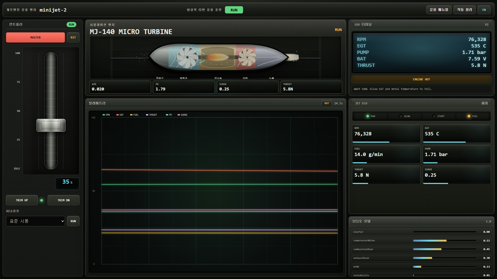

# Minijet-2

> **A realistic miniature jet engine simulation and operations bench, upgraded from the original Mini Jet Engine Sim.**

## 1. 소개 (Introduction)

Minijet-2는 소형 제트엔진의 시동, 연소, 압축, 터빈 구동, 배기, ECU 보호 로직을 더 현실적인 운용 경험으로 재구성한 웹 기반 시뮬레이터입니다.
이 프로젝트는 기존 프로젝트인 [Mini-Jet-Engine-Sim](https://github.com/JTech-CO/Mini-Jet-Engine-Sim)을 바탕으로 업그레이드되었으며, 단순한 시각 데모를 넘어 실제 터빈 운용 절차와 계기 판독 흐름을 구현하는 것을 목표로 합니다.



**주요 기능**
- **실시간 제트엔진 코어 시뮬레이션**: 흡기, 압축기, 연소실, 터빈, 노즐, 연료 펌프, 배터리, 열 지연, 스풀 관성을 TypeScript 모델로 계산합니다.
- **현실적인 ECU 시동 시퀀스**: MASTER/TRIM, 글로우, 스타터, 프라임, 라이트오프, 아이들 안정화, RUN 전환, 보호 상태를 단계적으로 처리합니다.
- **스큐어모피즘 운용 UI**: GSU 터미널, ECU 패널, 텔레메트리 오실로스코프, 오디오 미터, 금속 스로틀 컨트롤러를 조종 장비처럼 구성했습니다.
- **엔진 컷어웨이 시각화**: 흡기 입자, 다단 압축기, 연소 화염, 터빈 로터, 노즐 배기, 플라즈마/연기 효과를 실시간 telemetry에 맞춰 렌더링합니다.
- **오디오/고장/시나리오 모델**: starter, compressor whine, combustion roar, exhaust rush, instability, warning cue와 고고도/고온/저전압/연료 기포/연료 부족 시나리오를 제공합니다.
- **EN/KR 운용 문서**: 언어 전환 가능한 매뉴얼과 작동 원리 모달을 통해 조작 의도와 엔진 물리를 함께 설명합니다.

## 2. 기술 스택 (Tech Stack)

- **Frontend**: HTML, CSS, SVG, Canvas, TypeScript ES Modules
- **Backend**: 없음. 로컬 확인용 Node.js 정적 서버만 사용합니다.
- **State Management**: 프레임 기반 TypeScript simulation state
- **Testing**: Node.js built-in test runner
- **Deployment**: 정적 파일 빌드 후 `public/` 서빙

## 3. 설치 및 실행 (Quick Start)

**요구 사항**: Node.js 25 이상

1. **설치 (Install)**
   ```bash
   git clone https://github.com/JTech-CO/Minijet-2.git
   cd Minijet-2
   npm install
   ```

2. **환경 변수 (Environment)**

   별도의 환경 변수는 필요하지 않습니다.

3. **빌드 및 실행 (Build & Run)**
   ```bash
   npm run build
   npm run serve
   ```

   기본 주소는 다음과 같습니다.

   ```text
   http://127.0.0.1:4173/
   ```

4. **테스트 (Test)**
   ```bash
   npm test
   ```

## 4. 폴더 구조 (Structure)

```text
src/
├── app/                  # 브라우저 앱 진입점과 UI 렌더 루프
├── audio/                # 엔진 사운드 레이어와 경고음 모델
├── engine/               # ECU, 물리 모델, 스펙, 시나리오, 고장 복구 로직
├── instruments/          # GSU, telemetry, graph buffer, 계기 snapshot
├── qa/                   # 캘리브레이션/시나리오 QA 스위트
├── render/engineCutaway/ # 엔진 컷어웨이 시각화 상태 모델
└── state/                # telemetry 상태 어댑터

public/
├── index.html            # 시뮬레이터 UI shell
└── styles.css            # 스큐어모피즘 패널/엔진/계기 스타일

scripts/
├── build-browser.mjs     # TypeScript source를 브라우저용 JS로 변환
└── serve-static.mjs      # 로컬 정적 서버

tests/                    # 엔진 코어, 계기, 오디오/고장, QA 테스트

docs/                     # 설계 노트, 모델 가정, 단계별 리팩터링 문서
```

## 5. 정보 (Info)

- **Original Project**: [Mini-Jet-Engine-Sim](https://github.com/JTech-CO/Mini-Jet-Engine-Sim)
- **Repository**: [JTech-CO/Minijet-2](https://github.com/JTech-CO/Minijet-2)
- **License**: MIT
- **Contact**: [JTech-CO](https://github.com/JTech-CO)
